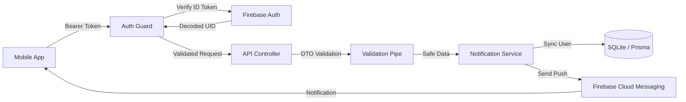

# Notification Management API


> **A scalable, clean-architecture backend service designed to manage push notifications with real-time FCM integration.**

This project serves as a robust backend solution for mobile applications requiring reliable push notification delivery, secure user synchronization, and strict data validation.

---

## 🏗 Architecture & Flow

The system follows a strict data flow ensuring security and integrity at every step.



---

## 🌟 API Documentation

We believe in **Interactive Documentation**. You don't need external tools to test our API.

### Interactive API Docs

The entire API is documented using **Swagger (OpenAPI)**. You can visualize schemas, test endpoints, and see example responses directly in your browser.

👉 **Live Demo:** [http://localhost:3000/api](http://localhost:3000/api)


> **Note:** All endpoints are protected. You must provide a valid Firebase ID Token via the "Authorize" button (Bearer Auth) to interact with the API.

---

## 🔥 Key Features

-   **Modular Architecture:** Separation of concerns with dedicated `Auth` and `Notification` modules, ensuring maintainability and scalability.
-   **Type-Safe Database:** Leverages **Prisma ORM** for fully type-safe database access, including specific Enums like `DeliveryStatus` (PENDING, SENT, FAILED).
-   **Security First:** Implements a custom **AuthGuard** that verifies Firebase ID Tokens at the middleware level, rejecting unauthorized requests before they reach the business logic.
-   **Data Integrity:** incoming requests are validated using `class-validator` and `class-transformer`. Invalid data (e.g., short titles or missing tokens) is automatically rejected with `400 Bad Request`.
-   **Defensive User Sync:** The system automatically handles user synchronization. If a notification is sent to a user not yet in the local DB, the system creates a placeholder record on-the-fly to prevent Foreign Key errors.
-   **Robust Error Handling:** Global exception filters and comprehensive logging ensure that issues are tracked without crashing the service.

---

## 💾 Database Schema

The project uses **SQLite** with **Prisma**. Below is a high-level overview of the data models.

| User | Type | Description |
| :--- | :--- | :--- |
| `id` | String | **PK**. Maps to Firebase UID. |
| `email` | String | Unique email address. |
| `fcmToken` | String? | Firebase Cloud Messaging device token. |
| `notifications` | Relation | One-to-many relationship with Notification. |

| Notification | Type | Description |
| :--- | :--- | :--- |
| `id` | String | **PK**. UUID. |
| `title` | String | Notification title. |
| `body` | String | Notification message body. |
| `deliveryStatus` | String | Status Enum (`PENDING`, `SENT`, `FAILED`). |
| `userId` | String | **FK**. Links to User. |

---

## 🚀 Installation & Setup

### 1. Prerequisites
-   Node.js (v18+)
-   npm or yarn

### 2. Install Dependencies
```bash
npm install
```

### 3. Environment Configuration
Create a `.env` file in the root directory:

```env
# Database
DATABASE_URL="file:./dev.db"

# Server
PORT=3000

# Firebase Service Account
GOOGLE_APPLICATION_CREDENTIALS="./service-account.json"
```

> **Important:** Download your `service-account.json` from the Firebase Console and place it in the root directory.

### 4. Database Setup
```bash
# Run migrations
npx prisma migrate dev --name init

# Generate Prisma Client
npx prisma generate
```

### 5. Run the Server
```bash
# Development
npm run start:dev

# Production
npm run build
npm run start:prod
```

---

## 📂 Project Structure

```bash
src/
├── app.module.ts            # Root Module
├── main.ts                  # Entry Point (Swagger & Global Pipes)
├── auth/                    # Authentication Module
│   ├── auth.controller.ts   # Sync Token Endpoints
│   ├── auth.guard.ts        # Firebase Token Validation
│   └── dto/                 # SyncTokenDto
├── notification/            # Notification Module
│   ├── notification.controller.ts
│   ├── notification.service.ts # FCM Integration & DB Logic
│   ├── dto/                 # CreateNotificationDto
│   └── enums/               # DeliveryStatus Enum
├── firebase/                # Shared Firebase Module
└── prisma/                  # Database Connection Module
```

---

